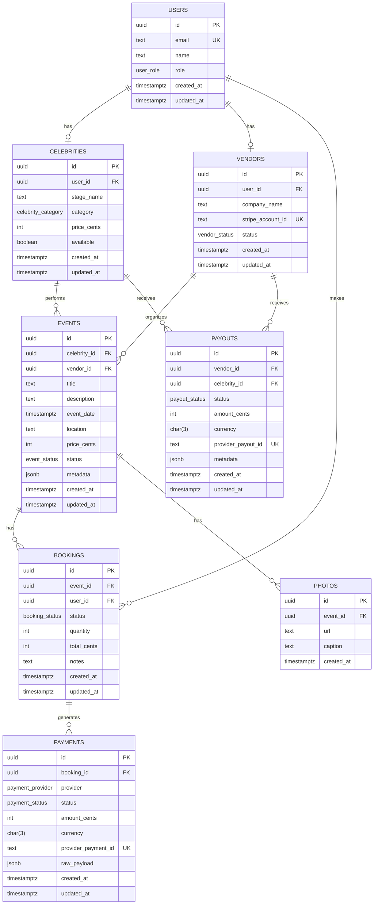

# Data Model

This document describes the initial database schema managed by Drizzle ORM and compatible with Neon Postgres.

Highlights:
- UUID primary keys generated via gen_random_uuid() (pgcrypto extension)
- Enum types for roles, statuses, and categories
- Timestamps (created_at, updated_at) on all core entities
- Rich relations with foreign keys and indexes
- jsonb metadata on events, payments (raw payload), and payouts

## Entity Relationship Diagram

## Enums
- user_role: customer, celebrity, vendor, admin
- celebrity_category: actor, athlete, musician, influencer, comedian, creator, other
- vendor_status: pending, active, suspended
- event_status: draft, published, cancelled, completed
- booking_status: pending, confirmed, cancelled, completed
- payment_provider: stripe, paypal, test
- payment_status: pending, succeeded, failed, refunded
- payout_status: pending, paid, failed

## Migrations
Generated with Drizzle Kit (SQL mode) and designed to be compatible with Neon.

Important Neon notes:
- Use sslmode=require in your DATABASE_URL
- gen_random_uuid() is enabled with the pgcrypto extension (created in the migration)

See README for commands to generate and run migrations.
